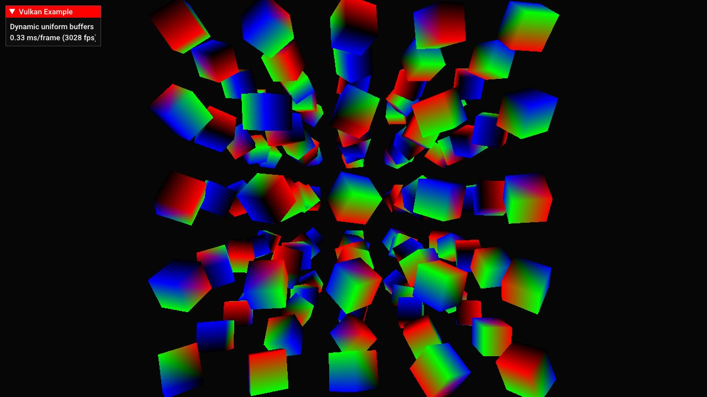

# 动态 Uniform Buffer



## 概要

使用一个 Uniform Buffer Object 作为动态 Uniform Buffer，从一个较大的 Uniform Buffer Object 中为多个对象读取不同的矩阵数据，从而绘制多个具有不同变换矩阵的对象。

## 要求

如果你需要使用超过 Vulkan 规范要求的 8 个动态 Uniform Buffer，应当通过设备限制参数 [maxDescriptorSetUniformBuffersDynamic](http://vulkan.gpuinfo.org/listreports.php?limit=maxDescriptorSetUniformBuffersDynamic) 检查当前设备支持的最大动态 Uniform Buffer 数量。

## 描述

本示例演示如何使用动态 Uniform Buffer，即 `VK_DESCRIPTOR_TYPE_UNIFORM_BUFFER_DYNAMIC`。它允许在调用 [vkCmdBindDescriptorSets](https://www.khronos.org/registry/vulkan/specs/1.0/man/html/vkCmdBindDescriptorSets.html) 绑定描述符集时，通过动态偏移量访问一个或多个 Uniform Block Object 中的不同数据区域。

与为每个描述符单独创建一个 Uniform Buffer 不同，动态 Uniform Buffer 可以把多个对象的数据存储在同一个 Uniform Buffer 中。

这样做可以减少所需的 Descriptor Set 数量，并且有助于优化内存写入。例如，在某些情况下，我们只需要对这块内存进行局部更新，而不必更新多个独立 Buffer。

在本示例中，我们会把多个对象的模型矩阵存储在一个动态 Uniform Buffer Object 中，并在绘制每个对象时通过偏移量访问对应的矩阵数据。

## 重点说明

### Shader 绑定

与静态的单个 Uniform Buffer 相比，Shader 端的绑定方式本身不需要改变。动态偏移量是在应用程序代码中完成的。

```glsl
layout (binding = 1) uniform UboInstance {
	mat4 model; 
} uboInstance;
```

### 准备 Uniform Buffer 及其内存

***注意：*** 在准备用于支持动态 Uniform Buffer Object 的主机端内存时，必须考虑当前设备实现的 [minUniformBufferOffsetAlignment](http://vulkan.gpuinfo.org/listreports.php?limit=minUniformBufferOffsetAlignment) 限制。

由于不同设备的对齐要求可能不同，而且这个对齐值通常不等于我们实际数据结构的大小，因此不能简单地使用 `vector` 并直接按普通指针连续访问。这里使用指针来管理对齐后的内存：

```cpp
struct UboDataDynamic {
  glm::mat4 *model = nullptr;
} uboDataDynamic;
```

第一步是根据 GPU 报告的最小 Uniform Buffer 偏移对齐值，计算我们要存储的数据实际需要的对齐大小：

```cpp
void prepareUniformBuffers()
{
	// 根据设备要求的最小 Uniform Buffer 偏移对齐值计算实际所需对齐大小
	size_t minUboAlignment = vulkanDevice->properties.limits.minUniformBufferOffsetAlignment;
	dynamicAlignment = sizeof(glm::mat4);
	if (minUboAlignment > 0) {
		dynamicAlignment = (dynamicAlignment + minUboAlignment - 1) & ~(minUboAlignment - 1);
	}
```

根据 Vulkan 规范，允许的最大对齐值可能达到 256 字节。这可能远大于我们实际需要的数据大小。例如，一个 4x4 矩阵只需要 64 字节。

现在我们已经知道了实际所需的对齐大小，就可以为动态 Uniform Buffer 创建主机端内存：

```cpp
  size_t bufferSize = OBJECT_INSTANCES * dynamicAlignment;
  uboDataDynamic.model = (glm::mat4*)alignedAlloc(bufferSize, dynamicAlignment);
```

其中，`alignedAlloc` 是一个小型封装函数，用于根据不同操作系统或编译器执行对齐内存分配。

创建 Buffer 的方式与普通 Uniform Buffer Object 基本相同：

```cpp
vulkanDevice->createBuffer(
  VK_BUFFER_USAGE_UNIFORM_BUFFER_BIT, VK_MEMORY_PROPERTY_HOST_VISIBLE_BIT, &uniformBuffers.dynamic, bufferSize);
```

这里没有使用 `VK_MEMORY_PROPERTY_HOST_COHERENT_BIT` 标志。后续更新数据时会手动 flush。

### 设置 Descriptor

Descriptor 的设置方式与普通 Uniform Buffer 基本相同，只是描述符类型改为 `VK_DESCRIPTOR_TYPE_UNIFORM_BUFFER_DYNAMIC`。

#### Descriptor Pool

本示例使用一个动态 Uniform Buffer，因此需要在 Descriptor Pool 中至少申请一个这种类型的描述符：

```cpp
void setupDescriptors()
{
  ...
  std::vector<VkDescriptorPoolSize> poolSizes = {
    ...
    vkTools::initializers::descriptorPoolSize(VK_DESCRIPTOR_TYPE_UNIFORM_BUFFER_DYNAMIC, 1),
    ...
  };
```

#### Descriptor Set Layout

顶点着色器接口中，存储模型矩阵的 Uniform 位于 `binding = 1`。这些矩阵会从动态 Uniform Buffer 中读取，因此需要设置一个匹配的 Descriptor Set Layout：

```cpp
void setupDescriptors()
{
  ...
  std::vector<VkDescriptorSetLayoutBinding> setLayoutBindings =  {
    ...
    vkTools::initializers::descriptorSetLayoutBinding(VK_DESCRIPTOR_TYPE_UNIFORM_BUFFER_DYNAMIC, VK_SHADER_STAGE_VERTEX_BIT, 1),
    ...
  };
```

#### Descriptor Set

本示例中，场景中的所有对象都使用同一个 Descriptor Set。这个 Descriptor Set 基于上面创建的 Descriptor Set Layout。

与 Layout 一样，我们把动态 Uniform Buffer 绑定到 `binding = 1`。Buffer 本身的描述符信息在创建 Buffer 时已经准备好。

```cpp
void setupDescriptors()
{
  ...
  std::vector<VkWriteDescriptorSet> writeDescriptorSets = {    
    // Binding 1：实例矩阵，作为动态 Uniform Buffer 使用
    vkTools::initializers::writeDescriptorSet(descriptorSet, VK_DESCRIPTOR_TYPE_UNIFORM_BUFFER_DYNAMIC, 1, &uniformBuffers.dynamic.descriptor),
  };
```

### 使用动态 Uniform Buffer

完成所有准备工作后，就可以使用动态 Uniform Buffer 中存储的不同矩阵来绘制多个对象。

```cpp
for (uint32_t j = 0; j < OBJECT_INSTANCES; j++)
{
  // 每个动态描述符都需要一个动态偏移量，用于定位到包含所有模型矩阵的 UBO 中的指定位置
  uint32_t dynamicOffset = j * static_cast<uint32_t>(dynamicAlignment);
  // 绑定描述符集，并传入动态偏移量，使当前 mesh 使用对应对象的矩阵数据进行渲染
  vkCmdBindDescriptorSets(drawCmdBuffers[i], VK_PIPELINE_BIND_POINT_GRAPHICS, pipelineLayout, 0, 1, &descriptorSet, 1, &dynamicOffset);

  vkCmdDrawIndexed(drawCmdBuffers[i], indexCount, 1, 0, 0, 0);
}
```

对于每个需要绘制的对象，都要根据前面计算出的 `dynamicAlignment` 计算它在动态 Uniform Buffer Object 内存中的偏移位置。

随后，在绑定 Descriptor Set 时，通过 `vkCmdBindDescriptorSets` 的 `dynamicOffsetCount` 和 `pDynamicOffsets` 参数传入这个动态偏移量。

对于当前绑定的 Descriptor Set 中的每一个动态 Uniform Buffer，都必须按照动态 Buffer 的 binding 索引顺序传入一个指向 `uint32_t` 的偏移量指针。

这样，在调用 `vkCmdDrawIndexed` 进行绘制时，Shader 读取到的就是从指定偏移位置开始的数据，也就是当前对象对应的模型矩阵。

### 更新 Buffer

创建 Buffer 时，我们没有指定 `VK_MEMORY_PROPERTY_HOST_COHERENT_BIT` 标志。

虽然使用 HOST_COHERENT 是可以的，但在真实项目中，通常只会更新动态 Buffer 中实际发生变化的部分。例如，只有某些对象在上一帧之后发生了移动，那么就只更新这些对象对应的数据区域。这样可以减少 CPU 到 GPU 的同步成本。

在这种情况下，通常需要使用 [vkFlushMappedMemoryRanges](https://www.khronos.org/registry/vulkan/specs/1.0/man/html/vkFlushMappedMemoryRanges.html) 手动 flush 更新过的内存范围，以确保 GPU 能看到 CPU 写入的新数据。

```cpp
VkMappedMemoryRange memoryRange = vkTools::initializers::mappedMemoryRange();
memoryRange.memory = uniformBuffers.dynamic.memory;
memoryRange.size = sizeof(uboDataDynamic);
vkFlushMappedMemoryRanges(device, 1, &memoryRange);
```

本示例中，为了简化逻辑，会始终更新整个动态 Buffer 的范围。
